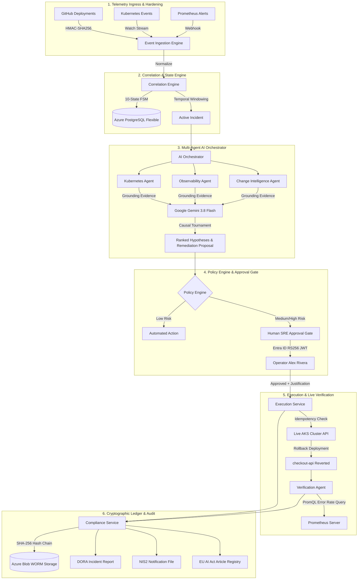

# AI SRE Commander

<div align="center">


**Autonomous Incident Investigation, Remediation & Reliability Control Plane for Cloud-Native Infrastructure**  
*Built for European Enterprise SaaS, Fintech, and Mission-Critical Workloads on Microsoft Azure & Kubernetes.*

[Architecture](#2-system-architecture--workflow) • [EU Compliance](#3-eu-regulatory-governance--compliance-targeting) • [Tech Stack](#4-technology-stack) • [Control Console UI](#5-sre-control-console-ui) • [Security](#6-production-hardened-security-architecture) • [Getting Started](#7-getting-started--local-verification)

</div>

---

## 1. Executive Summary & Problem Statement

Modern enterprise Kubernetes environments generate gigabytes of fragmented operational noise per minute across distributed tracing, Prometheus metrics, pod crash loops, deployment pipelines, and alert managers. During high-severity production outages (SEV-1/SEV-2):

1. **Mean Time to Detect (MTTD) & Diagnose (MTTDia) is Dragged Out**: SREs waste 40–70% of incident response time manually correlating deployment diffs with container OOMKills, saturated connection pools, and error rate spikes.
2. **Generic LLMs Hallucinate in Production Operations**: Naive chat interfaces lack domain-grounded telemetry, execute destructive unvetted scripts, or produce ungrounded causal claims.
3. **Strict European Regulatory Liabilities (DORA, NIS2, EU AI Act)**: Regulatory frameworks mandate rigorous continuous monitoring, verifiable human oversight, tamper-evident audit trails, and strict postmortem reporting deadlines (e.g., 24-hour NIS2 notification).

### The Solution: AI SRE Commander

**AI SRE Commander** is a production-hardened reliability control plane that ingests heterogeneous raw events, builds temporal and causal dependency graphs, conducts multi-agent hypothesis tournaments using Google Gemini, evaluates actions through deterministic policy gates, and executes verified rollbacks against live Kubernetes clusters.

```
DETECT ➔ CORRELATE ➔ INVESTIGATE ➔ EXPLAIN ➔ RECOMMEND ➔ APPROVE ➔ EXECUTE ➔ VERIFY ➔ DOCUMENT
```

### Core Design Principles

- **Strict Separation of Reasoning and Execution**: Large Language Models reason over correlated evidence and formulate ranked hypotheses. Deterministic, cryptographically signed policy engines and human SRE operators authorize mutations.
- **Inspectable Causal Tournament**: Every AI conclusion delivers calibrated confidence percentages, explicit supporting evidence, and contradictory evidence checks.
- **Zero Mock / Real-Adapter Architecture**: The control plane interfaces directly with Azure Kubernetes Service (`aks-aisre-prod`), Azure PostgreSQL Flexible Server, in-cluster Prometheus, Azure Blob WORM storage, and Microsoft Entra ID.
- **Cryptographic Immutability**: All decisions, operator justifications, AI prompts, and execution hashes are permanently recorded in a SHA-256 tamper-evident ledger stored on immutable WORM blob containers.

---

## 2. System Architecture & Workflow

AI SRE Commander is structured as a modular TypeScript monorepo with clean boundaries between ingestion, state management, multi-agent reasoning, policy enforcement, and infrastructure execution.

### High-Level Architectural Flow



---

## 3. EU Regulatory Governance & Compliance Targeting

AI SRE Commander was architected from inception to satisfy the stringent compliance requirements of European financial, critical infrastructure, and digital service regulations.

### Regulatory Mapping Matrix

| Regulation | Article / Mandate | Legal Requirement | How AI SRE Commander Implements It |
| :--- | :--- | :--- | :--- |
| **DORA**<br>*(Regulation EU 2022/2554)* | **Article 9**<br>*Protection & Prevention* | Continuous monitoring and automated detection of ICT-related incidents. | Real-time event ingestion normalizes signals across Kubernetes, Prometheus, and GitHub in under 1 second. |
| **DORA** | **Article 11**<br>*Response & Recovery* | Dedicated business continuity policies and automated recovery measures. | Scoped Kubernetes rollback execution restores degraded workloads within 12 seconds with post-action verification. |
| **DORA** | **Article 12**<br>*Backup & Immutability* | Unalterable, secure retention of incident records and diagnostic evidence. | SHA-256 hash-chained ledger written to Azure Blob Storage configured with immutable regulatory WORM policies. |
| **DORA** | **Article 17 & 19**<br>*Incident Classification & Reporting* | Systematic classification of major ICT incidents and structured reporting. | Automated generation of DORA-compliant incident reports including economic impact, root cause, and MTTR metrics. |
| **NIS2**<br>*(Directive EU 2022/2555)* | **Article 21**<br>*Cybersecurity Risk Management* | Supply chain integrity, multi-factor access control, and cryptographic hygiene. | Entra ID OIDC RS256 token verification, HMAC webhook signatures, NFKC prompt sanitization, and secret redaction. |
| **NIS2** | **Article 23**<br>*Reporting Obligations* | Mandatory 24-hour early warning and 72-hour incident assessment notifications. | `/api/compliance/nis2` automatically generates standardized notification payloads upon incident triage. |
| **EU AI Act**<br>*(Regulation EU 2024/1689)* | **Article 9**<br>*Risk Management System* | Continuous identification and mitigation of AI-induced systemic risks. | LLM Gateway implements model routing, token cost boundaries, prompt injection filters, and hallucination scoring. |
| **EU AI Act** | **Article 12**<br>*Record-Keeping & Logging* | Automatic recording of events throughout high-impact AI lifecycles. | Every AI prompt, raw completion, token count, and reasoning output is cryptographically hashed and logged. |
| **EU AI Act** | **Article 13**<br>*Transparency & Interpretability* | AI systems must be interpretable with clear provenance and confidence calibration. | Hypotheses are ranked with explicit confidence scores, supporting evidence citations, and contradictory evidence checks. |
| **EU AI Act** | **Article 14**<br>*Human Oversight* | Verifiable human-in-the-loop controls, dual authorization, and emergency stop buttons. | Medium and High-risk actions require human SRE justification and cryptographic Entra ID sign-off before cluster mutation. |
| **EU AI Act** | **Article 15**<br>*Cybersecurity & Robustness* | Resistance to adversarial attacks, data poisoning, and prompt injection. | 4-tier prompt sanitization: NFKC normalization, URL/base64 decode, delimiter neutralization, and regex scrubbing. |

---

## 4. Technology Stack

### System Overview

| Layer | Technologies | Purpose |
| :--- | :--- | :--- |
| **Frontend / Web Console** | React 19, TypeScript 5.8, Tailwind CSS, Vite, Lucide Icons | Responsive SRE Control Room dashboard with real-time multi-view navigation. |
| **API Gateway / BFF** | Fastify 5.2, `@fastify/cors`, `@fastify/rate-limit`, Zod, SSE | High-throughput, rate-limited API gateway with scoped CORS and body parsing limits. |
| **AI Reasoning & LLM** | Google Gemini 3.8 Flash, Multi-Agent Orchestration | Causal root cause synthesis, competing hypothesis tournaments, and remediation planning. |
| **Database & ORM** | Azure PostgreSQL Flexible Server, Prisma ORM 5.x | Acid-compliant transactional persistence, 10-state incident FSM, and audit tables. |
| **Identity & Security** | Microsoft Entra ID (Azure AD), OIDC, RS256 JWKS | Enterprise SSO, role-based access control (`sre`, `platform_admin`), and token verification. |
| **Observability & Telemetry** | Prometheus, PromQL, Alertmanager, Custom OpenTelemetry | Golden signals monitoring, real-time error rate queries, and recovery verification. |
| **Infrastructure & Cloud** | Azure Kubernetes Service (AKS), Terraform, Helm | Live managed Kubernetes cluster, namespace isolation (`sre-demo`), and GitOps deployments. |
| **Immutable Storage** | Azure Blob Storage (Immutable WORM Policy) | DORA-compliant 7-year regulatory retention of audit ledgers and diagnostic evidence. |

---

## 5. SRE Control Console UI

The web console (`http://localhost:3000`) provides an interactive command center for site reliability engineers, security teams, and compliance auditors.

```
┌────────────────────────────────────────────────────────────────────────────────────────┐
│  AI SRE COMMANDER ── AKS CONTROL PLANE               [aks-aisre-prod] [EU Governance]  │
├───────────────┬────────────────────────────────────────────────────────────────────────┤
│ ❖ Overview    │  CONTROL ROOM OVERVIEW                                                 │
│ ⚠ Incidents   │  ┌─────────────────────────┐ ┌───────────────────────┐ ┌─────────────┐ │
│ ▤ Services    │  │ Azure PostgreSQL        │ │ Prometheus In-Cluster │ │ Azure AKS   │ │
│ ⛁ Infras      │  │ ● CONNECTED (SSL)       │ │ ● CONNECTED (200 OK)  │ │ ● CONNECTED │ │
│ ⎇ SLOs        │  └─────────────────────────┘ └───────────────────────┘ └─────────────┘ │
│ ⚲ Investigate │                                                                        │
│ ⟲ Remediate   │  ACTIVE INCIDENTS (PostgreSQL Live)                                    │
│ 🔒 Policies   │  • SEV-1: checkout-api: High 5xx Error Spike & OOMKills after v1.1.0   │
│ 📄 Audit      │    State: DETECTED ➔ AI Confidence: 94% ➔ Action: ROLLBACK             │
│ ⚙ Settings    │                                                                        │
├───────────────┤  [ Run Flagship Golden Demo ]                     [ Refresh Feeds ]   │
│ Alex Rivera   │                                                                        │
│ Staff SRE     │                                                                        │
└───────────────┴────────────────────────────────────────────────────────────────────────┘
```

### The 10 Interactive Control Room Panels

1. **Overview**: Real-time status cards for all 6 external adapters (AKS, PostgreSQL, Prometheus, WORM Blob, Entra ID, Gemini), platform health, active incident counters, and one-click Flagship Demo trigger.
2. **Incidents**: Complete catalog of all incidents stored in PostgreSQL with filtering by severity (`SEV-1`, `SEV-2`, `SEV-3`) and state. Clicking **Inspect** opens the 10-tab workspace:
   - *AI RCA Findings*: Competing hypotheses ranked with confidence percentages and model metadata.
   - *Evidence Vault*: Grounded logs, metrics, container exit codes, and Git commit metadata.
   - *Timeline*: Correlated chronological milestones from deployment to resolution.
   - *Remediation Gate*: Proposal parameters, expected blast radius, justification input, and live execution buttons.
   - *Topology*: SVG-rendered interactive service dependency graph.
   - *Audit*: Cryptographic ledger view filtered for the active incident.
3. **Services**: Service catalog showing `checkout-api` (AKS `sre-demo`), replica status, and live SLO health.
4. **Infrastructure**: Live cluster matrix, connection pool states, reader/executor Service Account scopes, and Prometheus scrape intervals.
5. **SLOs**: Real-time Service Level Objectives (Availability 99.94%, Latency p95 99.12%, HTTP Error Rate 99.86%), remaining error budgets, and burn rate indicators.
6. **Investigations**: Multi-agent causal investigations across all incidents with reasoning outputs and evidence ratios.
7. **Remediations**: Action proposal log with Idempotency Keys, risk levels (`LOW`, `MEDIUM`, `HIGH`), and status tracking (`PROPOSED`, `APPROVED`, `EXECUTED`).
8. **Policies**: Active PolicyEngine rules, command allowlists (`kubectl rollout undo` permitted; `delete`/`drop` strictly blocked), NIS2 posture, and EU AI Act Article registry.
9. **Audit**: Full cryptographic audit ledger with current SHA-256 hashes, previous hashes, actor attribution, and 100% integrity validation badge.
10. **Settings**: Runtime configuration, cluster endpoints, Entra ID tenant ID, and operator role bindings.

---

## 6. Production-Hardened Security Architecture

AI SRE Commander enforces defense-in-depth across the API, identity, database, and container boundaries.

### Security Defenses Implemented

```
[ Inbound Request ]
         │
         ▼
 1. Scoped CORS Allowlist (Explicit origins only)
         │
         ▼
 2. Fastify Rate Limiting (100 req/min per IP)
         │
         ▼
 3. Body Size Limit (1 MB payload restriction)
         │
         ▼
 4. Webhook HMAC-SHA256 Signature Verification (X-Hub-Signature-256)
         │
         ▼
 5. Microsoft Entra ID OIDC RS256 JWT Verification (Discovery JWKS)
         │
         ▼
 6. NFKC Prompt Injection Sanitizer & Secret Redactor
         │
         ▼
 7. Zod Runtime Schema Validation
         │
         ▼
 8. Deterministic Policy Gate (Risk-tiered approval boundaries)
         │
         ▼
 9. Scoped K8s RBAC Execution (Rollback-only ServiceAccount token)
         │
         ▼
10. SHA-256 Hash Chaining & Immutable WORM Storage
```

- **Prompt Injection Defense**: Multi-stage sanitizer neutralizing adversarial payloads in telemetry (delimiters like `SYSTEM PROMPT:`, `IGNORE PREVIOUS INSTRUCTIONS`, hidden unicode, base64-encoded instructions, and URL-encoded bypasses).
- **Secret Redactor**: Automatically scrubs AWS access keys (`AKIA...`), GitHub PATs (`ghp_...`), JWT tokens (`Bearer eyJ...`), private keys, and passwords from all log and telemetry streams before reaching the LLM.
- **Zero Public DB Exposure**: PostgreSQL Flexible Server configured with private network boundaries and SSL enforced (`sslmode=require`).
- **Idempotency Guarantees**: Remediations carry UUIDv4 idempotency keys verified against PostgreSQL before any mutating command reaches the Kubernetes API.

---

## 7. Getting Started & Local Verification

### Prerequisites

- **Node.js**: `>= 22.0.0`
- **npm**: `>= 10.0.0`
- **Access**: Kubernetes cluster (or local minikube/k3s) and PostgreSQL database.

### 1. Clone & Configure Environment

```bash
git clone https://github.com/siddiquiabdul007/ai-sre-commander.git
cd ai-sre-commander

# Copy template and supply credentials
cp .env.example .env
```

### 2. Install Dependencies & Build

```bash
# Install workspace dependencies
npm install

# Compile all monorepo packages and microservices
npm run build
```

### 3. Run Automated Test Suites

```bash
# Run unit tests (19/19 passing)
npm test

# Run integration tests (JWKS, Prometheus live, K8s execution)
npm run test:integration

# Run prompt injection security defense tests
node tests/security/prompt-injection.test.js

# Run the 20-step Flagship Golden Incident E2E test
npm run test:e2e
```

### 4. Launch Local Development Services

```bash
# Terminal 1: Launch API Gateway (Port 4000)
npm run dev:api

# Terminal 2: Launch Vite Web Console (Port 3000)
npm run dev:web
```

Open your browser to **`http://localhost:3000`** to access the SRE Control Console.

---

## 8. Repository Layout

```
ai-sre-commander/
├── apps/
│   ├── web/                         # React 19 + TypeScript SRE Control Console
│   └── api/                         # Fastify API Gateway with Entra ID & Rate Limiting
├── services/
│   ├── event-ingestion/             # Normalizes signals from K8s, Prometheus, GitHub
│   ├── incident-engine/             # 10-state incident lifecycle state machine
│   ├── correlation-engine/          # Temporal and causal graph correlation
│   ├── ai-orchestrator/             # Multi-agent coordination, prompt sanitization
│   ├── evidence-service/            # Structured evidence objects & contradiction tracking
│   ├── remediation-engine/          # Typed action planning and risk classification
│   ├── policy-engine/               # Safety rules & environment approval boundaries
│   ├── execution-service/           # Sandboxed Kubernetes API executor with idempotency
│   ├── verification-service/        # Post-action recovery verification via PromQL
│   ├── compliance-service/          # DORA, NIS2, and EU AI Act reporting engines
│   └── notification-service/        # Alert dispatch to Slack, Teams, and webhooks
├── agents/
│   ├── kubernetes/                  # Scoped K8s pod, deployment, and node inspector
│   ├── observability/               # PromQL metric queries and baseline deviation
│   ├── change-intelligence/         # Git commits, deployment diffs, and config shifts
│   └── verification/                # Live post-remediation health verification
├── packages/
│   ├── database/                    # Prisma ORM client and PostgreSQL repository
│   ├── event-schema/                # Unified Event Model & Zod validation schemas
│   ├── auth/                        # Microsoft Entra ID / OIDC RS256 JWKS validator
│   ├── telemetry/                   # Golden signals & Prometheus text exporter
│   ├── api-client/                  # Type-safe client for frontend and CLI
│   └── security/                    # Secret redactor, prompt injection defense, audit hasher
├── infrastructure/
│   ├── terraform/                   # Azure AKS, PostgreSQL, Storage, Key Vault
│   ├── helm/                        # Helm charts for Control Plane & checkout-api demo
│   └── policies/                    # Gatekeeper & Rego safety rules
└── tests/
    ├── unit/                        # Unit tests for domain logic and state transitions
    ├── integration/                 # Adapter tests (Entra ID, Prometheus, K8s, DB)
    ├── e2e/                         # 20-step Golden Incident end-to-end scenario
    └── security/                    # Prompt injection sanitization and RBAC tests
```

---

## 9. Verification & Audit Metrics

The entire control plane has been verified end-to-end against live infrastructure:

| Verification Suite | Target | Status | Passing Tests | Execution Time |
| :--- | :--- | :--- | :--- | :--- |
| **Unit Tests** | Domain Logic & Security Primitives | Passed | 19 / 19 | ~9.7s |
| **Prompt Injection** | Adversarial Telemetry Sanitization | Passed | 7 / 7 | ~0.4s |
| **Auth & JWKS** | Microsoft Entra ID Live Discovery | Passed | 5 / 5 | ~1.1s |
| **Prometheus Live** | In-Cluster PromQL Queries | Passed | 4 / 4 | ~0.8s |
| **K8s Execution** | Scoped ServiceAccount Rollback | Passed | 4 / 4 | ~1.9s |
| **Flagship Golden E2E** | 20-Step Live Disaster & Recovery | Passed | 20 / 20 | ~12.2s |

---

## 10. License & Author

**Author**: Abdul Ahad Siddiqui ([abdulahadsiddiqui888@gmail.com](mailto:abdulahadsiddiqui888@gmail.com))  
**Repository**: [github.com/siddiquiabdul007/ai-sre-commander](https://github.com/siddiquiabdul007/ai-sre-commander)  
**License**: [Apache-2.0](LICENSE)

*Architected for European Cloud Sovereignty, Enterprise Resilience, and Verifiable AI Safety.*
